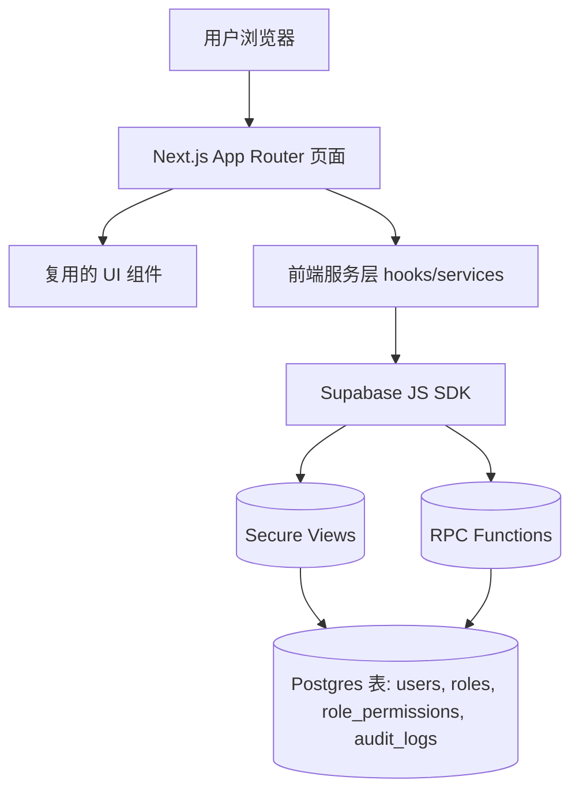
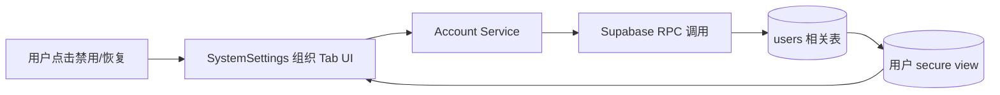
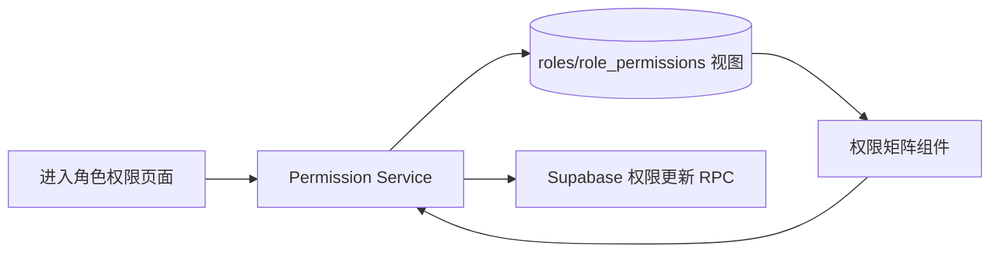
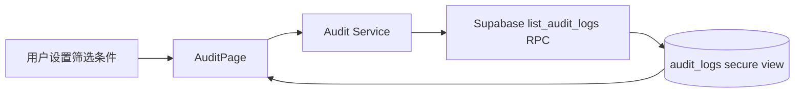

## Product Overview

在现有 Next.js App Router CRM 后台中，基于 Supabase（RLS、secure view、RPC），二期完善系统设置与审计能力：新增账号禁用/恢复完整流程、将角色权限矩阵接入真实权限数据，并新增审计日志页面，全部严格复用现有 v0 布局与组件（sidebar、top-bar、system-settings 等），并遵循 prd.md 定义的字段与交互。

## Core Features

- **组织账号禁用/恢复**
- 在 SystemSettings 的组织（Organization）Tab 中，为成员行增加账号状态展示（启用/已禁用）与禁用时间、操作者等信息。
- 复用现有表格/行操作组件，提供禁用/恢复入口（如行内按钮或操作菜单），操作后状态即时刷新。
- 禁用账号在界面中有明显灰度/标记，hover/tooltip 展示禁用原因；禁用状态下全局行为遵循 PRD 定义（例如不可登录或仅可读）。

- **角色权限矩阵真实数据接入**
- SystemSettings 中的角色权限矩阵使用真实数据：角色列表来自 roles，权限勾选来自 role_permissions 与 PRD 定义的权限 key。
- 表格行列布局不变：列为权限模块/操作，行为角色，每个单元格以勾选/开关展示是否拥有对应权限。
- 加载时展示加载态，支持根据 PRD 对权限进行分组、折叠与说明（tooltip/帮助文案），变更时保持与 PRD 一致的只读/可编辑范围。

- **审计日志 /audit 页面**
- 在现有 sidebar、top-bar 布局下新增 /audit 页面，入口与菜单视觉风格与其他一级菜单保持一致。
- 页面主体包含：筛选区（时间范围、操作者、对象类型、模块等）、日志列表表格，以及详情查看区。
- 日志表格列包括时间、操作者、动作类型、目标对象（含类型与标识）、来源模块等，支持分页与排序。
- 点击某一行可展开侧边 Drawer 或下拉区域，展示完整 audit_logs 记录详情（包括元数据与变更摘要），详情区域采用现有详情/Drawer 组件风格。
- 空数据、加载中、错误态都有清晰的反馈与占位展示，与现有 v0 统一。

- **统一视觉与交互**
- 所有新增元素（按钮、开关、标签、表格样式）严格复用现有组件与主题色，不引入新的视觉语言。
- 保持与 dashboard、analytics-dashboard 等页面一致的间距、排版及响应式行为，避免出现孤立的风格差异。

## Tech Stack

- 前端：Next.js App Router（现有项目）、React、TypeScript
- UI：复用既有布局与业务组件（sidebar、top-bar、system-settings、表格、Drawer 等）
- 数据访问：Supabase JS SDK（基于 Postgres RLS、secure view 读；RPC 作为唯一写入路径）
- 状态：React hooks 与项目内现有 store / context
- 接口数据格式：JSON

## System Architecture

采用分层单体架构：表示层（App Router 页面 + 复用组件）、领域服务层（Supabase RPC 封装）、数据访问层（视图/RPC 调用封装）。



- 账号禁用/恢复、权限矩阵更新只通过 RPC 写入。
- 审计日志读取来自带 RLS 的 secure view。

## Module Division

1. **Account Status Management Module**

- 职责：组织 Tab 中账号禁用/恢复 UI 与调用。
- 依赖：系统设置页面、Supabase RPC（如 `rpc_disable_user`, `rpc_restore_user`）、users 相关 secure view。
- 接口：前端服务 `disableUserAccount(id, reason)`, `restoreUserAccount(id)`。

2. **Role Permission Matrix Module**

- 职责：加载 roles 与 role_permissions，渲染角色权限矩阵，并提交变更。
- 依赖：roles/role_permissions 视图、权限配置常量（遵循 PRD 权限 key）、RPC（如 `rpc_set_role_permission`）。
- 接口：`fetchRolePermissions()`, `updateRolePermissions(roleId, changes)`。

3. **Audit Logs Module**

- 职责：/audit 页面布局、筛选、日志列表与详情展示。
- 依赖：audit_logs secure view、列表 RPC（如 `rpc_list_audit_logs`）、现有表格与筛选组件。
- 接口：`fetchAuditLogs(filters, pagination)`, `buildAuditFiltersOptions()`。

## Data Flow

### 账号禁用/恢复流程



- UI 更新本地状态并在 RPC 成功后刷新列表或乐观更新。
- 错误时展示统一错误提示组件。

### 权限矩阵加载与更新



- 初次加载时合并 PRD 权限 key 与数据库数据为矩阵。
- 更新后局部刷新对应角色权限状态。

### 审计日志查询



- 使用分页参数（limit/offset 或 cursor）进行高效查询。
- RLS 确保用户只能看到所属组织/租户的日志。

## Core Directory Structure

结合现有项目，建议结构如下（只列关键新增/修改部分）：

```
e:/iwish-sell-crm/
├── app/
│   ├── (dashboard)/
│   │   ├── system-settings/
│   │   │   ├── page.tsx
│   │   │   └── components/
│   │   │       ├── organization-tab.tsx
│   │   │       ├── role-permission-matrix.tsx
│   │   ├── audit/
│   │   │   ├── page.tsx
│   │   │   └── components/
│   │   │       ├── audit-filters.tsx
│   │   │       ├── audit-table.tsx
│   │   │       └── audit-detail-drawer.tsx
├── lib/
│   ├── supabase/
│   │   ├── client.ts
│   │   └── rpc.ts        # 包装 disable/restore、权限更新、日志查询 RPC
│   ├── services/
│   │   ├── account-service.ts
│   │   ├── permission-service.ts
│   │   └── audit-service.ts
│   └── types/
│       ├── account.ts
│       ├── permission.ts
│       └── audit.ts
```

## Key Code Structures

```typescript
// 账号与组织成员
export interface OrgMember {
  id: string;
  userId: string;
  name: string;
  email: string;
  status: 'active' | 'disabled';
  disabledReason?: string;
  disabledAt?: string;
  disabledBy?: string;
}

// 角色与权限
export interface Role {
  id: string;
  name: string;
  description?: string;
}

export interface RolePermission {
  roleId: string;
  permissionKey: string; // 与 PRD 权限 key 对齐
  allowed: boolean;
}

// 审计日志
export interface AuditLog {
  id: string;
  occurredAt: string;
  actorId: string;
  actorName: string;
  action: string;
  targetType: string;
  targetId: string;
  module: string;
  summary: string;
  metadata?: Record&lt;string, any&gt;;
}
```

```typescript
// 示例：Supabase RPC 封装
class AccountService {
  constructor(private supabase: SupabaseClient) {}
  async disableUserAccount(userId: string, reason: string) { /* 调用 rpc_disable_user */ }
  async restoreUserAccount(userId: string) { /* 调用 rpc_restore_user */ }
}

class PermissionService {
  async fetchRolePermissions(): Promise&lt;RolePermission[]&gt; { /* 查询 secure view */ }
  async updateRolePermissions(roleId: string, changes: RolePermission[]): Promise&lt;void&gt; {
    /* 调用批量更新 RPC */
  }
}

class AuditService {
  async fetchAuditLogs(filters: AuditFilters, pagination: Pagination): Promise&lt;AuditLogPage&gt; {
    /* 调用 list_audit_logs RPC */
  }
}
```

## Technical Implementation Plan (Highlights)

1. **账号禁用/恢复**

- 问题：在组织 Tab 中为成员提供安全可靠的禁用/恢复操作。
- 方案：新增操作按钮 + 确认弹窗；通过 RPC 更新数据库；刷新列表或乐观更新。
- 步骤：

    1. 在 organization-tab 中加入状态列与操作入口，复用已有按钮/菜单组件。
    2. 封装 `AccountService.disableUserAccount/restoreUserAccount`，调用对应 RPC。
    3. 操作前弹出确认对话框，可输入/选择禁用原因。
    4. 成功后刷新成员列表或更新本地状态；失败时展示错误提示。

- 挑战：确保禁用用户与登录状态的联动按 PRD 行为生效，不破坏现有会话逻辑。

2. **角色权限矩阵**

- 问题：现有矩阵需要接入真实角色/权限关系。
- 方案：从 roles 与 role_permissions 视图加载数据，结合 PRD 权限 key 渲染矩阵；通过 RPC 更新。
- 步骤：

    1. 在 permission-service 中实现 `fetchRolePermissions`，组合为矩阵数据模型。
    2. 将 role-permission-matrix 组件从 mock 改为真实数据驱动。
    3. 为可编辑单元格绑定切换事件，汇总更改为 `changes`。
    4. 调用 `updateRolePermissions` RPC，更新成功后重载或乐观更新。

- 挑战：按 PRD 控制只读角色/权限，防止越权修改。

3. **审计日志页面**

- 问题：根据 audit_logs schema 提供可筛选、可追踪的日志视图。
- 方案：新增 /audit 页面，封装 AuditService 调用列表 RPC 与 secure view。
- 步骤：

    1. 新建 audit/page.tsx，复用 dashboard 通用布局组件。
    2. 实现 AuditFilters 组件（日期范围、模块、操作者等），使用统一表单/选择器组件。
    3. 实现 AuditTable 组件（分页、排序、空态）、AuditDetailDrawer 组件展示详情。
    4. 在 AuditService 中封装日志查询 RPC 与分页逻辑，并结合 RLS 限制。

- 挑战：在大数据量下保持良好性能，避免一次性加载过多日志。

## Integration Points

- Supabase secure view：users/roles/role_permissions/audit_logs 视图，保证 RLS 生效。
- Supabase RPC：
- `rpc_disable_user`, `rpc_restore_user`
- `rpc_set_role_permission` 或类似批量更新接口
- `rpc_list_audit_logs`（支持过滤、分页、排序）
- 数据格式：JSON，前后端约定字段名与 PRD 一致。
- 认证：沿用现有 Supabase auth 方案，所有 RPC 在服务端或受保护的客户端环境中调用。

## Technical Considerations

- 性能：对日志列表使用分页与条件查询；在矩阵中避免一次性渲染过多节点，可按模块折叠。
- 安全：所有写操作强制走 RPC；确保 RLS 规则覆盖 audit_logs 与权限表；前端不暴露敏感字段。
- 可扩展性：RPC 设计采用模块与动作参数，便于未来新增权限或审计类型。
- 开发流程：新增功能单独创建 feature 分支，提供基础单元测试（服务层）与关键交互的集成测试，并在 PR 中对照 prd.md 自检。

## 设计概述

整体保持与现有 v0 后台风格一致，仅在当前体系内做结构与微交互优化，不引入全新视觉语言。页面采用标准后台三段式布局：左侧固定导航、顶部操作条、右侧内容区域，使用相同的排版、字号与间距系统。

### 1. SystemSettings 组织 Tab（账号禁用/恢复）

**布局块：**

1. 顶部导航条  

- 复用现有顶栏组件，显示当前模块标题「系统设置」，面包屑中突出「组织」。右侧保持原有全局操作按钮。

2. 组织成员工具栏  

- 位于内容顶部，左侧为搜索和筛选（按角色/状态），右侧保留新增成员按钮。组件样式沿用现有表单与按钮。

3. 成员列表表格  

- 使用现有表格组件，新增「状态」列展示启用/已禁用标签，颜色与现有状态标签一致。行尾添加「更多」操作菜单或行内按钮（禁用/恢复），禁用行文字轻微变浅。

4. 禁用/恢复确认弹窗  

- 调用通用 Modal 组件，标题为「确认禁用帐号」/「恢复帐号」。内容区域包含说明文案及禁用原因输入/选择，底部主按钮使用主色，取消按钮为弱化样式。

### 2. SystemSettings 角色权限矩阵

**布局块：**

1. 模块说明栏  

- 放在矩阵上方，使用信息提示组件说明权限矩阵含义与不可编辑规则，可包含「查看 PRD 权限说明」链接（如已有文档入口组件）。

2. 角色切换与过滤  

- 采用现有标签/下拉组件在顶部横向列出角色，支持选择特定角色或「全部角色」，当前角色高亮。

3. 权限矩阵表格  

- 继续使用现有表格组件：列为权限点或模块，行为角色；勾选使用统一的 Checkbox/Switch 组件。只读单元格呈灰色且禁用交互，同时提供 tooltip 显示权限描述和来自 PRD 的说明。

4. 保存/变更提示条  

- 当存在未提交变更时，在矩阵下方出现浅底色提示条，右侧为「保存更改」按钮，左侧显示变更计数；成功保存后使用现有全局通知组件提示。

### 3. 审计日志 /audit 页面

**布局块：**

1. 页面头部与筛选栏  

- 顶部标题为「审计日志」，配合轻量说明文字。下方为模块化筛选区：时间范围选择器、操作者选择、模块/对象类型多选，均复用当前筛选组件，并与其他列表页保持行高与间距一致。

2. 日志表格区  

- 使用统一表格组件，列包括时间（固定左对齐）、操作者、动作、目标、模块、摘要等。行 hover 采用与其他表格相同高亮效果。无数据时显示统一的空态插画与提示文案。

3. 详情 Drawer/面板  

- 点击行后在右侧拉出 Drawer，宽度与现有详情面板一致。上半部分为关键信息摘要，下半部分使用代码/JSON 高亮样式展示 metadata（若已有类似组件则复用）。

4. 分页与滚动  

- 底部使用统一分页组件，支持页码与每页条数控制。表格主体支持垂直滚动，顶部筛选栏固定在可视区域内，便于频繁调整条件。

### 字体与响应式

- 桌面端为主要场景，内容区域在 1440px 宽度下布局最优；在 1280px 与 1024px 宽度时表格列会自动合并/折叠次要信息到详情内。
- 使用统一字体、字号与粗细层级，确保新增页面与 dashboard、analytics-dashboard 在视觉上完全统一。

## Agent Extensions

- **subagent:code-explorer**
- Purpose: 在仓库中快速定位 system-settings、已有表格组件和 Supabase 调用封装位置。
- Expected outcome: 明确可复用组件与服务文件，减少重复实现。

- **mcp:Figma**
- Purpose: 对照或补充现有设计文件，校准组织、角色矩阵与审计页面的布局与视觉细节。
- Expected outcome: 新增界面在间距、字号、对齐方式上完全贴合既有设计规范。

- **mcp:chrome-devtools**
- Purpose: 在浏览器中检查 DOM 结构与样式，调试交互行为与性能问题。
- Expected outcome: 保障禁用/恢复、矩阵勾选和日志列表在真实环境下表现稳定、无视觉错位。