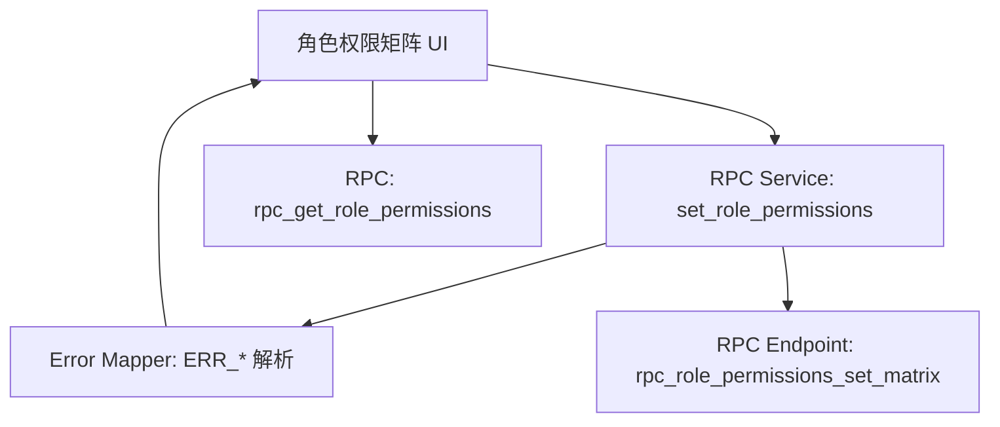
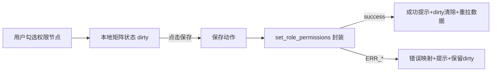

## Product Overview

将权限管理的可用入口统一收敛到「角色权限矩阵」。用户仅通过角色维度配置权限节点并保存；保存时提供清晰的成功/失败反馈与可恢复的编辑状态。设置页不再展示「用户覆盖权限 / 字段策略 / 自定义范围集」等入口，避免误操作与配置分裂。

## Core Features

- **入口收敛**：设置页移除/隐藏上述面板入口；仅保留「角色管理 → 角色权限矩阵」的配置路径与引导文案。
- **矩阵保存**：在角色权限矩阵中支持一键保存当前角色的权限节点勾选结果；保存中按钮禁用并展示加载态。
- **错误码解析与反馈**：保存失败时根据错误码显示明确提示（如无权限、参数异常、服务繁忙），并保留用户当前编辑状态以便重试。
- **一致性防护**：在未保存变更离开页面时提示；保存成功后刷新矩阵展示，确保与服务端一致。

## Tech Stack（沿用现有项目）

- Frontend: Next.js (App Router) + React + TypeScript
- RPC: 复用现有 Postgres RPC：`public.rpc_role_permissions_set_matrix`、`public.rpc_get_role_permissions`

## Architecture Design

- Pattern：分层（UI层 / RPC封装层 / 错误映射层）
- 高层组件关系

## Module Division

- **RolePermissionMatrixUI**
- 职责：矩阵渲染、勾选交互、保存/离开提示、成功/失败提示
- 依赖：RPC Service、Error Mapper
- **RolePermissionsService**
- 职责：封装 `set_role_permissions` 调用与请求体组装（不新增 permission key，复用现有 key）
- 对外：`setRolePermissionsMatrix(roleId, matrixPayload)`
- **RpcErrorMapper**
- 职责：解析 `ERR_NO_PERMISSION:*` 与通用错误，输出可展示的标题/描述/建议动作

## Data Flow（保存）

## Core Directory Structure（建议）

- `components/role-permission-matrix/*`
- `services/role-permissions.ts`
- `utils/rpc-error-mapper.ts`
- 相关入口调整：`components/system-settings.tsx`（及其路由入口组件）

## API Contract（前端侧）

- `rpc_role_permissions_set_matrix`：入参包含 `role_id` 与 `permissions_matrix`（按现有后端约定字段）
- 错误码：重点处理 `ERR_NO_PERMISSION:*`，其余走兜底提示与重试建议

## Design Style

玻璃拟态 + 深浅双色自适应的企业级控制台风格；交互强调状态可见性（保存中/成功/失败/未保存）。

## Page Planning（2页）

1) **角色管理-角色权限矩阵页**

- Block1 顶部导航：角色选择下拉、返回、保存按钮（含加载态与禁用态）
- Block2 矩阵主体：左侧权限分组，右侧节点网格；悬停高亮行列，支持全选/反选
- Block3 反馈区域：保存成功 toast；失败用高对比错误条，含“重试”按钮
- Block4 底部状态栏：显示“未保存更改/最后保存时间/当前角色”

2) **系统设置页（入口收敛后）**

- Block1 顶部导航：设置标题与搜索
- Block2 设置分组列表：隐藏「用户覆盖权限/字段策略/自定义范围集」入口
- Block3 权限相关提示卡：提示“权限配置请前往角色管理-角色权限矩阵”
- Block4 底部导航：通用帮助/反馈入口

## Agent Extensions

- **code-explorer**（SubAgent）
- Purpose: 全仓定位权限入口、RPC封装位置、相关组件引用链
- Expected outcome: 输出需修改文件清单与关键调用点，避免遗漏隐藏入口

- **chrome-devtools**（MCP）
- Purpose: 本地验证保存交互、错误提示、离开未保存提示与禁用态
- Expected outcome: 录得关键交互验证结果（成功/无权限/网络失败）并修正UI细节

- **Figma**（MCP）
- Purpose: 快速对齐矩阵页的反馈组件（错误条/Toast/状态栏）与入口收敛后的设置页布局
- Expected outcome: 产出2页低保真到中保真稿，指导实现一致的视觉与状态表达