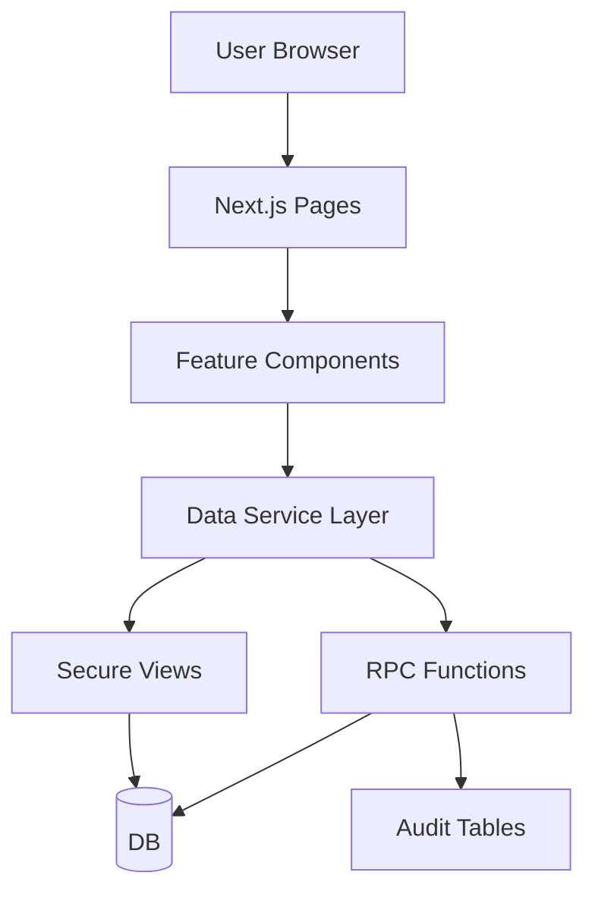
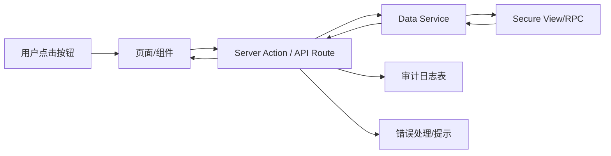

## Product Overview

对现有 CRM 中仍依赖前端假数据或未写入数据库的模块进行统一补齐，实现实时数据展示、可追溯操作记录，以及与现有权限矩阵和审计能力保持一致的交互体验。

## Core Features

- **Dashboard KPI 与近期活动**
- 使用真实指标和活动数据，支持时间/负责人筛选。
- 顶部 KPI 卡片+折线/柱状图+近期活动时间轴，状态颜色区分。

- **SalesFunnel 漏斗视图**
- 各线索/商机阶段数量、转化率实时统计，支持按团队/所有人切换。
- 漏斗图+分段标签，点击某段跳转关联列表页。

- **System Settings – BusinessRules**
- 规则列表、创建/编辑、启停与优先级排序。
- 表格+标签展示规则范围与状态，右侧抽屉编辑表单。

- **System Settings – 组织架构 UI**
- 组织→部门→团队→成员层级展示与编辑。
- 左侧树形结构+右侧详情卡片，支持拖拽调整与权限矩阵联动高亮。

- **公海导入 / 导出**
- 导入：多步向导、字段映射、校验结果、导入进度与错误下载。
- 导出：条件筛选、导出批次列表与状态标记。

- **分析报表（去 mock）**
- 核心报表接入真实统计，支持多维过滤与图表联动。
- 图表区+过滤栏+指标说明，支持数据导出按钮。

- **字段策略 & 自定义范围集管理**
- field_policies 与 custom_scope_sets 列表、详情与编辑。
- 以表格+标签显示策略生效对象，支持“预览影响对象”侧边栏。

- **用户权限 & 权限预览**
- user_permissions 管理界面，按用户/角色查看与编辑权限。
- 权限预览面板调用预览能力，结构化展示可见数据范围与操作。

- **线索转移与关闭动作**
- 列表和详情页提供统一操作入口，支持批量转移/关闭。
- 弹窗选择目标所有者/关闭原因，操作结果和审计信息明显提示。

## Tech Stack

- 前端：Next.js App Router（React + TypeScript）、组件库（MUI）
- 数据访问：Supabase JS 客户端（安全视图 + RPC）
- 状态管理：React Query / SWR 统一远程数据缓存
- 日志与审计：统一在服务层封装操作描述、操作者与目标对象

## System Architecture

采用前端分层单体架构：页面组件 → 领域 UI 组件 → 数据服务层 → Supabase 视图/RPC。



## Module Division

- **Dashboard 模块**
- 职责：KPI、近期活动、过滤器。
- 依赖：数据服务层 dashboardService。
- 接口：`getDashboardKpis(filters)`, `getRecentActivities(filters)`。

- **SalesFunnel 模块**
- 职责：漏斗统计与跳转。
- 依赖：funnelService。
- 接口：`getFunnelStats(filters)`。

- **SystemSettings – BusinessRules**
- 职责：展示/编辑业务规则。
- 依赖：settingsService。
- 接口：`listRules()`, `upsertRule()`, `toggleRule()`。

- **SystemSettings – 组织架构**
- 职责：组织树与成员详情。
- 依赖：orgService、权限矩阵已有模块。
- 接口：`getOrgTree()`, `moveNode()`, `updateMemberRole()`。

- **公海导入/导出模块**
- 职责：导入向导、导出任务管理。
- 依赖：importExportService。
- 接口：`startImport()`, `getImportStatus()`, `exportLeads()`。

- **分析报表模块**
- 职责：多报表统计展示。
- 依赖：reportsService。
- 接口：按报表拆分，如 `getLeadOverviewReport()`。

- **权限与策略管理模块**
- 职责：field_policies、custom_scope_sets、user_permissions 管理与权限预览。
- 依赖：permissionsService。
- 接口：`listFieldPolicies()`, `listScopeSets()`, `listUserPermissions()`, `previewPermissions()`。

- **线索动作模块**
- 职责：转移/关闭等动作。
- 依赖：leadsActionService。
- 接口：`transferLeads()`, `closeLeads()`。

## Data Flow

用户动作通过组件调用统一服务层，再由服务层访问安全视图或 RPC，并记录必要的审计信息。



## Core Directory Structure

```
e:/iwish-sell-crm/
├── app/
│   ├── dashboard/
│   ├── sales-funnel/
│   ├── settings/
│   ├── reports/
│   └── api/              # server actions / route handlers
├── lib/
│   ├── services/         # *Service 封装 Supabase 访问
│   ├── supabase/         # 客户端初始化与类型
│   └── audit/            # 审计封装
└── components/           # 复用 UI 组件
```

## Key Code Structures

```typescript
// 示例：Dashboard KPI
interface KpiSummary {
  name: string;
  value: number;
  changeRate: number;
}

class DashboardService {
  async getKpis(filters: KpiFilter): Promise&lt;KpiSummary[]&gt; {}
  async getRecentActivities(filters: ActivityFilter): Promise&lt;Activity[]&gt; {}
}

// 示例：线索动作
class LeadsActionService {
  async transferLeads(payload: TransferPayload): Promise&lt;ActionResult&gt; {}
  async closeLeads(payload: ClosePayload): Promise&lt;ActionResult&gt; {}
}
```

## Technical Implementation Plan（概括）

1. 建立统一服务层：封装所有安全视图查询与 RPC 调用，并统一注入审计参数。
2. 为 Dashboard、SalesFunnel、公海导入/导出、报表等模块替换 mock 为服务层调用。
3. 新增字段策略、自定义范围集、用户权限管理与权限预览界面，调用对应视图与 RPC。
4. 将线索转移与关闭操作接入动作服务层，确保权限校验与审计落库。
5. 对关键接口增加错误与空状态处理，并做性能优化（按需加载、分页）。

## 设计概览

采用偏企业级的现代 Material 风格：深色固定侧边栏 + 浅色内容区，强调信息密度与可读性。顶部应用栏提供搜索、全局过滤和用户入口。大量使用卡片、表格和图表，搭配柔和渐变与状态色，所有关键交互有悬浮、点击反馈与加载骨架，整体响应式适配常见桌面与大屏场景。

### 页面规划（核心 5 页）

1. **Dashboard**

- 顶部导航 + 全局筛选条
- KPI 卡片栅格区（支持 hover 详情）
- 趋势图/漏斗图区域
- 右侧近期活动时间轴与快速跳转

2. **SalesFunnel & 报表总览**

- 顶部条件过滤（时间、团队、负责人）
- 主漏斗图 + 指标条
- 下方按阶段拆分的列表/表格
- 右侧分析备注/指标说明抽屉

3. **System Settings – BusinessRules**

- 设置页顶部标签导航
- 规则列表表格（状态、范围、优先级）
- 规则编辑抽屉表单（多步/折叠）
- 底部规则变更审计时间线区域

4. **System Settings – 组织与权限**

- 左侧组织树（支持展开、拖拽）
- 中间成员列表与角色标签
- 右侧权限矩阵预览（只读）
- 底部选中对象的权限变更历史条

5. **公海导入/导出中心**

- 顶部导入/导出 Tab 切换
- 当前任务列表（进度条、状态徽标）
- 导入向导弹窗（步骤进度条）
- 导入结果与错误下载区域

## Agent Extensions

### SubAgent

- **code-explorer**
- Purpose: 在整个仓库中搜索仍使用 mock 数据或本地 state 的模块与相关类型。
- Expected outcome: 产出一份精确的文件与位置清单，用于后续替换为真实数据调用。

### MCP

- **chrome-devtools**
- Purpose: 在集成 Supabase 视图与 RPC 后抓取网络请求，验证参数、响应与权限错误。
- Expected outcome: 各关键接口请求路径、入参、耗时与错误情况被验证并记录，支持性能与错误优化。