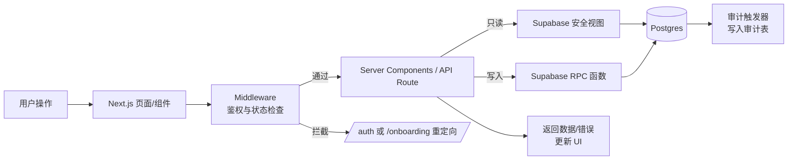

## Product Overview

Iwish CRM 是一套面向销售团队的线索全生命周期管理系统，围绕注册审批、账号生命周期、颗粒级权限控制和关键操作审计构建，提供从线索录入、分配、跟进到报表分析的一站式工作台。

## Core Features

- **认证与准入**
- `/auth` 支持注册、登录、重置密码等页面。
- 账号采用审批制，未通过审批前仅可访问受限页面。
- 通过 profiles 状态机控制账号生命周期（待审批、启用、冻结、禁用等）。

- **Onboarding 与账号初始化**
- `/onboarding` 引导新用户完成个人资料、团队信息、角色与权限范围确认。
- 根据状态机自动跳转到对应流程或仪表盘。
- 关键字段填写过程提供进度指示与校验反馈。

- **Dashboard 工作台**
- `/dashboard` 提供可配置首页，包括关键指标卡片、线索概览、待办与活动时间线。
- 支持按角色呈现不同模块区块，如管理视角与销售视角。
- 集成里程碑与公告提示，展示审计与系统变更摘要。

- **Leads 线索全流程**
- `/leads` 提供看板视图、公海池、列表与详情页。
- 支持多维筛选、批量操作、转派、回收、公海认领等动作。
- 按权限和范围控制可见线索与可执行动作，隐藏或置灰无权限字段。

- **System Settings 与权限配置**
- `/settings` 提供组织、角色、权限策略、范围与字段级控制配置界面。
- 可配置动作优先级、数据范围与字段可见/可写规则，支持预设模板。
- 通过分步表单与对比预览，降低配置错误风险。

- **Audit 审计中心**
- `/audit` 展示关键操作审计记录，支持按用户、对象、动作、多条件搜索。
- 支持查看单一对象的操作时间线与变更前后对比。
- 标注重要里程碑事件并可加标签与备注。

- **Reports 报表与分析**
- `/reports` 提供线索转化、渠道效果、业务员绩效等报表。
- 支持按时间、团队、标签等维度切片与导出。
- 保证仅在授权范围内聚合与展示数据。

## 技术栈与架构

- 前端：Next.js App Router + TypeScript（现有项目基础上增量改造）
- UI 组件：复用现有组件体系，局部补充基于 shadcn/ui 的表单、表格与抽屉组件
- 数据层：Supabase Postgres + SQL（表/视图/触发器/函数）+ RLS 政策
- 服务接口：Supabase RPC 作为唯一写入入口；只读访问通过安全视图
- 鉴权与安全：Next.js Middleware + Supabase Auth + Edge 准入拦截

### 系统架构模式

采用「前端应用层 + BFF/服务编排 + 数据与安全层」的分层单体架构：

```mermaid
graph TD
  Browser[Browser / Client] --> NextApp[Next.js App Router]
  NextApp --> Middleware[Next.js Middleware\n准入与路由守卫]
  NextApp --> BFF[Server Components / API Route\nBFF & 业务编排]
  BFF --> SupabaseRPC[Supabase RPC\n(写入/敏感操作)]
  BFF --> SupabaseView[Supabase 安全视图\n(只读查询)]
  SupabaseRPC --> DB[(Postgres 数据库)]
  SupabaseView --> DB
  DB --> AuditLog[审计表 & 触发器]
```

- 所有写操作必须经过 Supabase RPC。
- RLS 对视图和 RPC 均生效，由 profiles/status 和权限策略驱动。

### 模块划分

1. **核心数据与安全模块**

- 职责：设计表结构、类型、触发器、RLS、RPC、种子数据。
- 依赖：无（项目起点）。
- 对外：安全视图（leads_view 等）、RPC 函数（leads_create、leads_update、auth_approve_profile 等）。

2. **Auth & Middleware 模块**

- 职责：Supabase Auth 集成、JWT 解析、profiles 状态机对路由准入的控制。
- 依赖：profiles 表与状态字段、权限视图。
- 对外：`middleware.ts` 准入逻辑、`/auth/*` 页面与 hooks（useCurrentUser/useProfile）。

3. **Onboarding 模块**

- 职责：基于 profiles 状态机的引导流，完成资料与团队信息初始化。
- 依赖：Auth & Middleware、核心数据模块。
- 对外：`/onboarding/*` 路由与向 RPC 提交初始化信息的服务。

4. **Leads 模块**

- 职责：线索看板、公海池、详情与动作（认领、分配、变更状态等）。
- 依赖：核心数据模块、权限计算模块、Audit 模块（写操作审计）。
- 对外：`/leads` 页面、组件（LeadKanban、LeadDetailDrawer 等）。

5. **Settings & Permissions 模块**

- 职责：角色配置、动作优先级、范围与字段级策略管理。
- 依赖：核心数据模块（roles、policies 表）、Auth。
- 对外：`/settings/*` 路由，权限策略管理 UI，缓存与预览。

6. **Audit & Reports 模块**

- 职责：审计记录查询与报表展示。
- 依赖：AuditLog 表与视图；Leads/Settings 等业务模块。
- 对外：`/audit`、`/reports` 页面与统计查询服务。

### 数据流



- 数据在 BFF 层转换为前端友好结构，同时注入权限标记（可见/可写/可执行）。
- 错误处理：RPC 或视图查询错误统一映射为安全的业务错误码，前端统一提示。

### 目录结构建议

```
e:/iwish-sell-crm/
├── app/
│   ├── auth/
│   ├── onboarding/
│   ├── dashboard/
│   ├── leads/
│   ├── settings/
│   ├── audit/
│   └── reports/
├── lib/
│   ├── supabase/        # 客户端 & 服务端封装
│   ├── auth/            # profiles 状态机、权限计算
│   ├── permissions/     # 动作+范围+字段策略
│   ├── audit/           # 审计写入与查询封装
│   └── types/
├── components/
│   ├── layout/
│   ├── leads/
│   ├── settings/
│   ├── audit/
│   └── common/
└── supabase/
    ├── migrations/
    ├── seeds/
    └── rpc/
```

### 关键代码结构示例

```typescript
// 权限计算核心结构
export interface PermissionScope {
  resource: 'lead' | 'user' | 'report';
  action: 'read' | 'write' | 'assign' | 'export';
  scope: 'own' | 'team' | 'organization' | 'custom';
  fields: {
    readable: string[];
    writable: string[];
  };
}

export class PermissionService {
  constructor(private profileId: string) {}

  async getEffectivePermissions(): Promise&lt;PermissionScope[]&gt; {
    // 查询 Supabase 视图 / RPC，合并策略，并按优先级决策
  }

  can(action: string, resource: string, field?: string): boolean {
    // 应用动作优先级 + 范围 + 字段策略
    return false;
  }
}

// 审计写入封装
export interface AuditEvent {
  actorId: string;
  objectType: 'lead' | 'profile' | 'setting';
  objectId: string;
  action: string;
  before?: unknown;
  after?: unknown;
  milestone?: boolean;
}

export async function logAudit(event: AuditEvent) {
  // 调用 Supabase RPC: audit_log_event(event)
}
```

### 技术实施顺序（对应 PRD 推荐顺序）

1. **Supabase SQL/RLS/RPC 与种子数据**

- 设计核心表：profiles、roles、permissions、leads、audit_logs 等。
- 定义 profiles.status 状态机（pending、active、suspended、disabled...）。
- 为 leads、settings、audit 等设计 RLS 政策。
- 统一编写 RPC：所有写操作通过 RPC，附带审计触发。

2. **Next.js Middleware 安全准入**

- 在 `middleware.ts` 中解析会话与 profile 状态。
- 按路由分层准入：未登录 → `/auth`；待审批/待初始化 → `/onboarding`；冻结/禁用 → 阻断并显示提示。
- 对 `/settings` 等高敏感路由增加角色校验。

3. **Auth & Onboarding 路由/页面**

- `/auth`：登录、注册、重置密码 UI + Supabase Auth 接入。
- `/onboarding`：分步完成个人资料、组织/团队信息、初始偏好等。
- 基于状态机完成 Onboarding 后自动转入 `/dashboard`。

4. **Leads 读视图 + 写 RPC**

- 构建 `leads_view` 安全视图，结合 RLS 控制可见线索。
- Kanban、公海池、列表与详情复用现有组件，仅调整数据源与权限逻辑。
- 所有线索操作调用相应 RPC（create/update/assign/claim/recycle），自动写入审计。

5. **System Settings 权限后台**

- `/settings` 下划分组织信息、角色管理、权限策略、范围与字段配置子页。
- 提供策略预览与冲突检测，展示最终生效的权限矩阵。
- 修改策略写入 RPC，并触发审计里程碑事件。

6. **Audit 审计页**

- `/audit` 查询审计视图，支持多条件过滤、单对象时间线与差异视图。
- 对里程碑事件（如权限变更、大批量线索操作）提供显著标记。

7. **Reports 报表**

- 基于安全视图构建聚合视图或 RPC（已经过滤权限）。
- `/reports` 提供关键指标图表，支持导出且遵循范围/字段权限。

### 性能与安全要点

- 在视图与 RPC 层控制最小数据集，避免前端侧过滤敏感数据。
- 对权限计算增加缓存层（按 profile / role 缓存一段时间），避免频繁查询。
- 所有导出与批量操作必须记入审计，并严格校验权限。

## 整体设计风格

采用现代化玻璃拟物 + 仪表盘风格，突出专业感与安全感。大面积深色渐变背景上叠加半透明卡片，结合柔和阴影与细边框，营造层次清晰的后台体验。保持与现有 v0 UI 的布局逻辑一致，仅在配色、间距与细节上升级。

- 布局：典型三段式结构（侧边导航 + 顶部栏 + 主内容），底部提供全局状态/辅助导航条。
- 交互：悬浮、点击、拖拽（看板）、切换标签等动作配合细腻过渡动画。
- 响应式：桌面优先，兼容大屏展示；在宽屏下可扩展为双栏或三栏内容区。

### 覆盖页面（6 个）

本次详细设计覆盖：`/auth`、`/onboarding`、`/dashboard`、`/leads`、`/settings`、`/audit` 六个核心页面。

---

### `/auth` 认证页

- 顶部栏：品牌 Logo 与系统名称，居中对齐，背景渐变。
- 主表单卡片：居中半透明卡片，包含登录/注册切换标签。
- 辅助信息区：右侧/下方展示系统特性与安全提示。
- 底部栏：版权、隐私政策与语言切换。

### `/onboarding` 引导页

- 顶部栏：显示当前用户头像、昵称和 Onboarding 进度。
- 进度步骤条：分步展示资料、团队、偏好等步骤。
- 表单区域：宽卡片分组字段，提供实时校验与提示。
- 底部栏：上一步/下一步按钮与“保存并稍后完成”入口。

### `/dashboard` 仪表盘

- 顶部栏：搜索框、全局过滤（时间、团队）、用户菜单。
- 指标卡片区：展示线索数量、转化率等关键指标，支持轻微动效。
- 活动与任务区：左侧活动时间线，右侧待办列表/快捷入口。
- 底部栏：系统状态、版本信息与快速链接。

### `/leads` 线索中心

- 顶部栏：线索搜索与多维筛选（阶段、渠道、标签等）。
- 视图切换区：标签切换 Kanban、公海池、列表视图。
- 主内容区：看板列/公海表格/列表 + 详情抽屉，字段依权限显示。
- 底部栏：批量操作状态提示与当前权限说明。

### `/settings` 系统设置

- 顶部栏：当前组织信息与环境标识（如生产/测试）。
- 左侧设置导航：组织、成员、角色、权限策略、审计策略等。
- 主配置区：表单+表格组合，支持权限矩阵与差异对比。
- 底部栏：最近修改人/时间与“恢复默认/导出配置”按钮。

### `/audit` 审计中心

- 顶部栏：复杂过滤器（用户、对象类型、动作、时间区间）。
- 审计列表：时间轴式列表，每条记录突出动作与对象摘要。
- 详情面板：右侧抽屉展示字段变更前后 diff 与里程碑标签。
- 底部栏：导出按钮与数据保留策略提示。

## 可用 Agent 扩展

### SubAgent

- **code-explorer**
- Purpose: 在现有 Next.js 仓库中跨目录检索与阅读代码，理解当前 v0 UI 结构与数据访问方式。
- Expected outcome: 输出当前路由、组件与数据层实现的结构化映射，支撑后续在不大规模重写 UI 的前提下进行增量开发与重构。