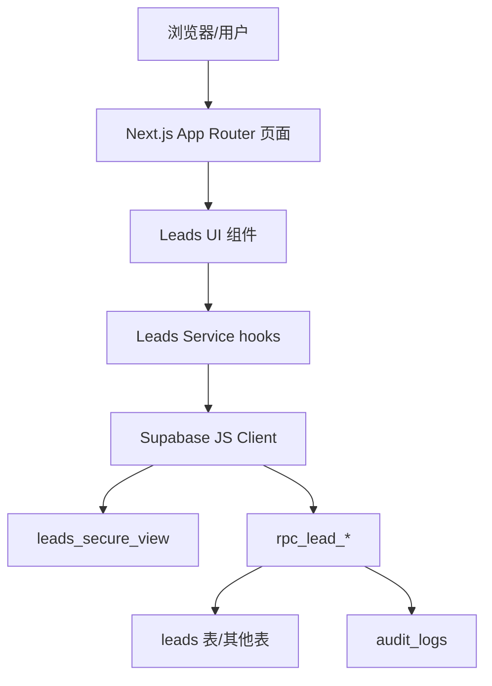
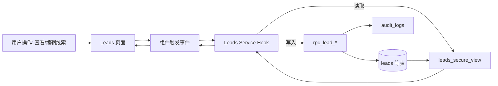

## Product Overview

“我的线索”页提供销售对个人线索的统一查看、筛选、编辑与跟进能力，并在界面层完整体现负责人、客户信息、预算、跟进计划、风险状态与操作权限等关键信息，实现可审计的线索操作闭环。

## Core Features

- 线索列表：展示客户名称、预算、负责人、最新跟进时间、下次跟进日期、状态与风险提醒等核心字段，支持排序与分页。
- 负责人选择与分配：在列表或详情中切换负责人，弹出原因与备注输入；保存后界面即时刷新负责人与相关统计。
- 线索编辑：在侧边滑出或详情面板中编辑客户名、预算等字段，保存后同步更新列表与统计展示。
- 跟进记录与计划：支持新增跟进记录，记录作者信息，并在界面中设置和展示线索级“下次跟进日期”。
- 风险提醒条：在列表上方或单条卡片中展示风险提示条，基于最近联系时间、下次跟进日期等字段高亮显示不同风险等级。
- 销售人员下拉与统计：顶部筛选区域展示销售人员下拉，选项中显示各自活跃线索数量，切换后刷新列表。
- 权限与操作控制：界面按钮与操作入口根据真实权限动态控制可见与可用状态，不再依赖写死角色判断，并在必要位置提示无权限说明。

## Tech Stack

- 前端：Next.js App Router + React（沿用现有项目栈）
- 数据层：Supabase（PostgreSQL、RLS、Security View、RPC、Audit Logs）
- 状态管理：React 组件本地状态 + 轻量全局状态（如 hooks/contexts）
- 接口调用：基于 Supabase 客户端与现有 rpc_lead_* 系列方法

## System Architecture

采用分层单体架构：展示层（页面与组件）- 应用层（hooks / services）- 数据访问层（Supabase RPC 与安全视图）。



## Module Division

- **Leads List 模块**  
- 职责：加载并展示“我的线索”列表，支持筛选、排序、分页与风险提醒条。  
- 依赖：Leads Service、权限模块。  
- 接口：`getMyLeads(query)` 调用 leads_secure_view。

- **Lead Edit & Detail 模块**  
- 职责：编辑客户名、预算等字段，查看详情；在侧边抽屉中操作。  
- 依赖：Leads Service。  
- 接口：`updateLeadCoreFields` 使用 rpc_lead_update_*。

- **Ownership & Assignment 模块**  
- 职责：负责人选择/变更，记录原因与备注并写入审计。  
- 依赖：Leads Service、权限模块。  
- 接口：`assignLeadOwner` 调用 rpc_lead_assign_*，写 audit_logs。

- **Follow-up & Next Contact 模块**  
- 职责：新建跟进记录（含作者），维护线索级 next_contact_at。  
- 依赖：Leads Service。  
- 接口：`addLeadFollowUp` / `updateNextContactAt` RPC。

- **ActiveLeads & Metrics 模块**  
- 职责：销售人员下拉与 activeLeads 数量统计，风险计算。  
- 依赖：Leads Service。  
- 接口：`getActiveLeadsStats`，`computeRiskByDates`。

- **Permissions & Security 模块**  
- 职责：从安全视图/用户信息推导前端权限，控制按钮与入口显示。  
- 依赖：认证上下文、RLS 规则。  
- 接口：`getLeadPermissionsFromViewRow`。

## Data Flow



- 读取：所有列表与详情数据仅通过 leads_secure_view 获取，自动受 RLS 约束。  
- 写入：编辑核心字段、变更负责人、新建跟进、更新 next_contact_at 等全部通过 rpc_lead_*，RPC 内部写入业务表与 audit_logs。  
- 错误处理：Service 捕获错误，向 UI 返回统一错误对象；UI 通过 Toast/行内错误展示。

## Core Directory Structure

```
e:/iwish-sell-crm/
├── app/
│   ├── leads/
│   │   ├── page.tsx          # 我的线索主页面
│   │   ├── components/
│   │   │   ├── LeadsTable.tsx
│   │   │   ├── LeadFilters.tsx
│   │   │   ├── LeadDetailDrawer.tsx
│   │   │   ├── RiskBanner.tsx
│   │   │   └── OwnerSelect.tsx
│   └── api/
│       └── leads/            # 如使用 Route Handlers
├── components/
│   └── ui/                   # 既有通用 UI 组件
├── lib/
│   ├── supabaseClient.ts
│   ├── leads/
│   │   ├── service.ts        # 封装调用 leads_secure_view & rpc_lead_*
│   │   └── permissions.ts    # 由视图行推导权限
└── ...
```

## Key Code Structures

```typescript
// 核心数据模型
interface Lead {
  id: string;
  customer_name: string;
  budget: number | null;
  owner_id: string;
  last_contact_at: string | null;
  next_contact_at: string | null;
  status: string;
  risk_level?: 'low' | 'medium' | 'high';
  can_edit: boolean;
  can_reassign: boolean;
}

interface FollowUpPayload {
  lead_id: string;
  content: string;
  next_contact_at?: string | null; // 线索级更新
}

class LeadsService {
  async fetchMyLeads(params: { ownerId?: string; page: number; q?: string }): Promise&lt;Lead[]&gt; {}
  async updateLeadCoreFields(id: string, data: Partial&lt;Lead&gt;): Promise&lt;void&gt; {}
  async assignLeadOwner(id: string, newOwnerId: string, reason: string, note?: string): Promise&lt;void&gt; {}
  async addFollowUp(payload: FollowUpPayload): Promise&lt;void&gt; {}
  async fetchActiveLeadsStats(): Promise&lt;Array&lt;{ owner_id: string; active_count: number }&gt;&gt; {}
}
```

## Technical Implementation Plan (Highlights)

1. **线索核心字段落库补齐**  

- 方案：在 leads 表确认/补充 next_contact_at 等字段；LeadsService 中统一使用 leads_secure_view 返回这些字段，避免前端 mock。  
- 步骤：  
1) 对照 PRD 与现有 schema，确认缺失字段；
2) 如需要，增加/调整 leads 字段并更新视图；
3) LeadsService.fetchMyLeads 返回完整字段；
4) 前端将输入组件绑定到真实字段并保存通过 rpc_lead_update_*。
- 风险：字段迁移可能影响现有代码；通过 feature 分支与回归测试降低风险。

2. **负责人选择与重新分配原因/备注审计**  

- 方案：OwnerSelect 组件调用 assignLeadOwner，RPC 内处理 owner_id 更新与 audit_logs 写入（含 reason/note）。  
- 步骤：  
1) 确认/新增 rpc_lead_assign_* 签名（含 reason/note）；
2) OwnerSelect 弹出分配对话框，收集原因与备注；
3) 调用 LeadsService.assignLeadOwner；
4) 成功后刷新当前列表行与 activeLeads 统计。
- 挑战：确保重复提交防抖与权限校验；前端按钮根据 can_reassign 控制。

3. **跟进记录作者与下次跟进日期落库**  

- 方案：新增跟进对话框调用 rpc_lead_add_followup_*，由 RPC 写 followups 表并记录 author_id，若设置下次跟进日期则同步更新 leads.next_contact_at。  
- 步骤：  
1) 在 RPC 中使用当前用户 ID 作为 author；
2) 前端 FollowUp 表单增加“下次跟进日期”字段；
3) 成功后刷新当前线索行与 Detail 面板；
4) 风险条重新根据 last_contact_at/next_contact_at 计算。

4. **activeLeads 统计与销售下拉**  

- 方案：在 RPC 或视图中预聚合 activeLeads 数量，前端仅展示返回数据；避免前端统计。  
- 步骤：  
1) 增加/确认统计 RPC；
2) LeadsService.fetchActiveLeadsStats 封装调用；
3) 销售下拉组件展示 “姓名 (N)”；
4) 切换销售时刷新列表参数。

5. **风险提醒条逻辑实现**  

- 方案：在前端根据 last_contact_at、next_contact_at 及 PRD 规则计算 risk_level，或者由 leads_secure_view 直接给出 risk_level 字段。  
- 步骤：  
1) 确认规则（如超过 X 天未联系为高风险）；
2) 在视图或 Service 中计算 risk_level；
3) RiskBanner 使用颜色/图标区分等级；
4) 支持点击风险条筛选对应线索。

6. **前端权限控制改造（去除写死角色）**  

- 方案：在 leads_secure_view 或额外安全视图中返回每条线索的权限位（如 can_edit、can_reassign、can_view_budget），前端仅依赖这些布尔值渲染。  
- 步骤：  
1) 在视图定义中根据 RLS 与角色计算权限字段；
2) LeadsService 将权限一起返回；
3) UI 根据权限禁用按钮/隐藏入口并给出提示文案；
4) 保留服务端 RLS 拒绝作为第二道防线。

## Performance & Security

- 性能：  
- 列表使用分页与服务器端筛选；  
- activeLeads 统计走聚合 RPC，避免前端循环统计；  
- 合理为 owner_id、last_contact_at、next_contact_at 建索引。  

- 安全：  
- 所有读取使用 leads_secure_view，禁止直接访问表；  
- 所有写入通过 rpc_lead_*，在函数内统一进行权限检查与 audit_logs 写入；  
- 前端不暴露角色逻辑，仅根据视图返回权限字段控制 UI。  

## Scalability & Workflow

- 可扩展性：权限位、风险规则均通过视图/RPC 可配置扩展；LeadsService 作为统一数据访问层便于复用。  
- 开发流程：  
- 使用 feature 分支，按模块提交；  
- 针对 LeadsService 与关键组件编写单元/集成测试；  
- 在合并前进行线索读取/编辑/分配/跟进/审计的回归测试。

## 页面设计概述

“我的线索”页沿用现有布局与组件体系，采用现代企业风格与轻量 Glassmorphism 结合。整体为宽屏三栏结构：顶部导航 + 筛选区 + 列表主区 + 右侧详情抽屉，下方保留固定操作栏，重点突出活跃线索、风险提醒与下一步行动。

### 页面模块划分

1. **顶部导航栏**  
细高条形顶部栏，左侧为页面标题“我的线索”与简要统计（总数/活跃数），右侧放筛选快速入口和全局按钮，背景半透明并带轻微模糊与阴影，随滚动保持固定。

2. **筛选与销售下拉区**  
位于导航下的横向滤镜区域，包含搜索输入、销售人员下拉（带 activeLeads 数字徽标）、状态筛选标签与日期区间选择。筛选项采用 pill 形标签与圆角输入框，交互有细微浮动和高亮边框动画。

3. **线索列表主区**  
主体为可排序表格或卡片表格混合布局：左侧固定展示客户名称与预算，中间展示负责人、最近联系时间、下次跟进日期，右侧为状态标签与操作入口。每行 hover 时高亮背景与淡淡阴影，点击打开右侧详情抽屉。风险较高线索在行左侧有色条提示。

4. **风险提醒条与统计区**  
列表顶部插入风险提醒条，可根据 risk_level 显示不同颜色的警示背景和图标（如黄色中风险、红色高风险），并展示“X 条高风险线索待跟进”等文案，点击可快速筛选到对应线索。提醒条使用渐变背景和柔和发光边界。

5. **线索详情抽屉/侧边面板**  
右侧滑出的详情面板展示完整线索信息：上半部分为客户和预算编辑区域，下半部分为跟进记录时间线与下次跟进日期选择控件。各字段使用表单组件，并保留保存/取消按钮。时间线以卡片形式展示作者、时间与内容，新增跟进位于顶部输入卡中。

6. **底部固定操作与分页栏**  
页面底部悬浮操作栏，左侧为当前筛选结果摘要，右侧为分页控制和批量操作按钮（如批量分配等）。栏背景半透明并带上边框投影，使整体层次清晰，与顶部导航呼应。

交互风格统一采用平滑过渡、hover 微动画与明确的状态反馈（加载、成功、失败），确保在不大改 UI 结构的前提下，明显提升可用性与信息层次。

## Agent Extensions

### SubAgent

- **code-explorer**  
- Purpose: 递归浏览并检索 `e:/iwish-sell-crm` 仓库中与“我的线索”页面和 leads 模块相关的文件与实现。  
- Expected outcome: 找到现有 leads 页面、LeadsService、Supabase 调用与 RPC 定义的位置，为补齐字段与操作提供依据。

### MCP

- **chrome-devtools**  
- Purpose: 在浏览器环境中对“我的线索”页面进行调试与性能分析，捕获接口请求、响应与渲染瓶颈。  
- Expected outcome: 确认前后端数据绑定是否正确、接口错误处理是否完善，并为性能优化提供具体指标。