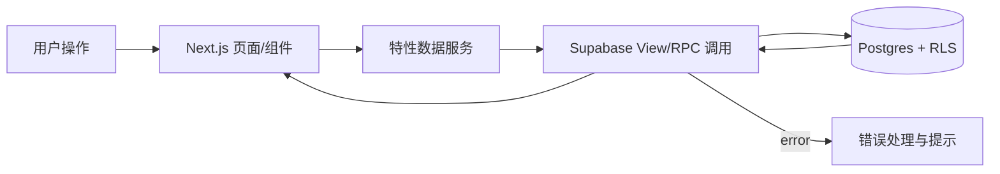

## Product Overview

在现有 Next.js App Router 与 Supabase 项目和 v0 原型基础上，完善 CRM 系统的公海池、组织架构与业务规则、仪表盘及分析报表、个人信息与安全设置等模块，并将 Dashboard、Leads、PublicPool、Analytics、SystemSettings 等页面接入真实数据与权限体系，前端布局与信息架构保持与 v0 原型一致，仅做局部增强。

## Core Features

- **公海池与线索处理**
- 公海线索列表、筛选、排序，支持按来源、标签、负责人状态过滤。
- 线索领取、退回、锁定、超时回收等操作按钮，操作结果通过轻量通知与状态标签反馈。
- 列表行展示重要字段与状态徽标，支持批量操作与悬浮查看摘要。

- **公海权限与审计**
- 可视化角色权限矩阵，按角色与动作维度展示可读、可写、可操作的交叉表。
- 公海相关操作审计列表：时间线样式的操作记录，支持按用户、对象、动作过滤。
- 在各相关页面提供“查看权限说明”侧边滑出层，展示当前用户在该对象上的权限详情。

- **仪表盘与数据分析报表**
- Dashboard 页面展示核心 KPI 卡片、趋势折线图、漏斗图等组件，可按时间范围和团队维度切换。
- Analytics 页面提供可配置报表列表、图表切换（表格/图表视图）、导出与分页。
- 图表颜色与样式统一，使用柔和对比色、悬浮提示、空状态占位图。

- **组织架构与业务规则**
- 组织架构树形视图，支持展开/折叠部门节点，展示成员头像、姓名与角色标签。
- 部门与角色详情侧栏，配置分配规则、审批流、回收规则等业务参数。
- 业务规则配置界面采用分段表单与步骤指示器，提供规则生效范围与优先级提示。

- **登录后个人信息与安全设置**
- 个人资料页面：头像、姓名、邮箱、手机号编辑区，使用卡片布局与内联校验提示。
- 安全设置：密码修改、二次验证开关、登录设备列表与会话管理，使用分组卡片与醒目的风险提示色。
- 所有设置变更提供显式确认对话框与结果反馈条。

- **系统设置与页面接入真实数据**
- SystemSettings 中权限、组织、业务规则等子页统一使用真实视图与 RPC 数据源。
- Dashboard、LeadKanban、PublicPool、Analytics 等页面增加加载中骨架屏、空状态与错误提示组件。
- 按权限动态控制按钮可见性与操作可用状态，使用禁用态与说明文案提示。

## Tech Stack

- 前端：Next.js App Router（TypeScript, React），复用现有 v0 组件与布局
- 数据访问：Supabase JS SDK，统一走 View 与 RPC
- 数据层：Supabase Postgres（表、视图、函数、RLS 为唯一安全边界）
- 状态管理：React Query 或 SWR 管理远程数据，请求结合 URL 查询参数

## System Architecture

采用分层单体架构：页面路由层、特性组件层、数据服务层、Supabase 接入层、数据库与 RLS。

```mermaid
graph TD
  U[Browser] --> P[Next.js App Router Pages]
  P --> C[Feature Components]
  C --> S[Data Services (lib/services)]
  S --> R[Supabase Views &amp; RPC]
  R --> DB[(Postgres + RLS)]
  DB --> LOG[Audit Tables &amp; Views]
```

## Module Division

- **公海池模块**
- 职责：公海线索列表、操作入口、权限与回收规则结果展示。
- 依赖：线索表视图、领取/退回 RPC、公海审计视图。
- 接口：`rpc_public_pool_list`、`rpc_claim_lead`、`rpc_return_lead` 等。

- **线索看板模块**
- 职责：按阶段展示线索卡片，支持拖拽更新阶段与负责人。
- 依赖：线索视图、阶段更新 RPC、权限视图。
- 接口：`view_leads_kanban`、`rpc_update_lead_stage`。

- **仪表盘与分析模块**
- 职责：KPI 卡片、趋势与漏斗图、灵活报表。
- 依赖：聚合视图或统计 RPC。
- 接口：`view_dashboard_kpi`、`rpc_analytics_report(query)`。

- **组织与权限模块**
- 职责：组织树、成员管理、角色矩阵视图、业务规则配置。
- 依赖：组织表、角色表、权限矩阵视图、规则 RPC。
- 接口：`view_org_tree`、`view_role_matrix`、`rpc_upsert_rule` 等。

- **系统与个人设置模块**
- 职责：系统级开关、个人资料、安全设置。
- 依赖：用户表视图、Supabase Auth、配置表。
- 接口：`view_user_profile`、`rpc_update_profile`、`rpc_update_security`.

- **审计与日志模块**
- 职责：记录并展示关键业务操作日志。
- 依赖：审计表、审计视图。
- 接口：`view_audit_logs`、按对象过滤的专用视图。

## Data Flow



- 数据在 UI 中通过 React Query/SWR 缓存，依参数自动重新获取。
- 所有写操作仅通过 RPC 发起，由 RLS 与函数内部逻辑校验权限并写入审计表。
- 错误统一转译为用户友好的提示，并在必要时展示“无权限”状态。

## Core Directory Structure

```text
e:/iwish-sell-crm/
├── app/
│   ├── dashboard/
│   ├── leads/
│   ├── public-pool/
│   ├── analytics/
│   ├── org/
│   └── settings/
├── components/
│   ├── layout/
│   └── features/
├── lib/
│   ├── supabase/
│   └── services/
└── db/            # DDL、视图、RLS、RPC 定义
```

## Key Code Structures

```typescript
interface Lead {
  id: string;
  title: string;
  status: string;
  owner_id: string | null;
  source: string;
  updated_at: string;
}

interface PublicPoolEntry extends Lead {
  locked_until?: string | null;
}

interface OrgUnit {
  id: string;
  name: string;
  parent_id: string | null;
}

interface RolePermissionMatrixRow {
  role_id: string;
  resource: string;
  action: string;
  allowed: boolean;
}

interface AuditLog {
  id: string;
  actor_id: string;
  resource: string;
  action: string;
  target_id: string;
  created_at: string;
}
```

```typescript
// 示例服务
class PublicPoolService {
  async list(params: { search?: string; filter?: string }) {}
  async claim(id: string) {}
  async return(id: string) {}
}

class AnalyticsService {
  async fetchDashboardKpi(filters: Record&lt;string, any&gt;) {}
  async fetchReport(payload: Record&lt;string, any&gt;) {}
}
```

## Technical Implementation Plan

1. **公海池与权限控制**

- 问题：实现安全的领取/退回/回收逻辑，并与权限矩阵对齐。
- 方案：以 RLS+视图暴露可见数据，所有状态变更通过 RPC 完成，在 RPC 内执行权限检查与审计写入。
- 步骤：

    1. 设计公海相关表结构与视图（含锁定与超时字段）。
    2. 定义 RLS 策略，限制可见与可操作记录。
    3. 编写领取、退回、回收 RPC，并在内部写入审计表。
    4. 在 PublicPool 页面接入列表与操作按钮，处理加载/空/错误状态。
    5. 为权限不足情况提供“无权限”提示与禁用态按钮。

- 挑战：并发领取冲突，使用事务和条件更新避免重复分配。

2. **角色矩阵与组织架构**

- 问题：支持图形化的角色与权限配置，同时保障规则一致性。
- 方案：提供只读权限矩阵视图与写入 RPC，组织树通过层级表或闭包表视图输出。
- 步骤：

    1. 定义角色、资源、动作映射表与权限矩阵视图。
    2. 定义组织表结构与组织树视图。
    3. 实现角色矩阵读写 RPC，控制仅管理员可配置。
    4. 在 Org 与 SystemSettings 页面构建矩阵与树形 UI。
    5. 通过 RPC 将矩阵配置同步到 RLS 相关策略所依赖的配置表。

- 挑战：变更矩阵后，需确保 RLS 读取的配置同步且不破坏既有数据。

3. **仪表盘与分析报表**

- 问题：在不暴露底层表的前提下提供高性能聚合数据。
- 方案：采用聚合视图或 RPC 聚合，必要时使用物化视图。
- 步骤：

    1. 设计 KPI 与报表指标字段，建立聚合视图或 RPC。
    2. 为不同过滤条件设计参数化 RPC。
    3. 在 Dashboard 页面接入 KPI 卡片与图表。
    4. 在 Analytics 页面实现多报表切换与筛选。
    5. 支持导出功能，通过 RPC 生成可下载数据集。

- 挑战：大数据量下聚合性能，使用索引和预聚合优化。

4. **个人信息与安全设置**

- 问题：提供用户自助管理资料与安全状态，并与 Supabase Auth 协同。
- 方案：通过视图暴露用户资料，通过 RPC 更新资料与安全设置，敏感操作复用 Auth 能力。
- 步骤：

    1. 定义 user_profile 视图整合业务字段与 Auth 信息。
    2. 实现资料更新 RPC，进行基础校验。
    3. 实现密码修改与会话管理的操作调用。
    4. 在 settings/profile 页面构建 UI 并接入数据。
    5. 为高风险操作提供二次确认与反馈提示。

- 挑战：避免泄露其他用户信息，严格以当前用户 ID 过滤。

## Integration Points

- Supabase Auth 用于登录态、当前用户信息、密码修改等。
- 所有前端数据访问统一使用 Supabase SDK 调用视图与 RPC，禁止直接访问底层表。
- 图表组件与表格组件复用现有 v0 设计，保持数据与交互一致。

## Technical Considerations

- **性能优化**：列表分页、延迟加载图表、必要时使用物化视图与缓存。
- **安全措施**：所有写入通过 RPC，RLS 保证行级访问控制；前端仅做体验层校验。
- **可扩展性**：视图与 RPC 接口尽量参数化，方便后续增加字段与过滤条件。
- **开发流程**：先补齐 db 目录中的 DDL/RLS/视图/RPC，再逐页面接入数据与权限，并通过审计视图验证行为。

## 设计概述

- **整体布局**：延续 v0 原型模式，左侧固定侧边栏，顶部顶栏，右侧为内容区。侧边栏突出模块分组与当前高亮，顶栏展示搜索、全局筛选与个人入口。
- **视觉风格**：现代企业级风格，结合 Material 卡片与轻微玻璃拟态效果，适度圆角与柔和阴影。整体偏浅色主题，强调信息密度与可读性。
- **Dashboard 页面**
- 顶部 KPI 卡片栅格布局，下方是趋势图与漏斗图区域。
- 卡片使用渐变背景与图标，悬浮显示细节，空状态使用浅色插画。
- **Leads 与 PublicPool 页面**
- Leads 采用横向多列看板布局，列头展示阶段名称与数量，卡片支持拖拽。
- PublicPool 为高密度表格视图，表头固定、支持列宽调整，重要字段使用徽标与标签色突出。
- **Analytics 页面**
- 左侧为报表列表与筛选，右侧为图表或数据表切换。
- 图表使用统一色板，支持缩放、悬浮提示与区间高亮。
- **组织与权限页面**
- 组织树在左侧垂直展示，右侧为部门详情卡片与成员列表。
- 权限矩阵采用冻结首行首列的表格布局，允许横向滚动，支持单元格悬浮提示说明。
- **个人信息与系统设置页面**
- 使用分组卡片布局，分为资料、安全、偏好等区块。
- 高风险操作（密码、设备注销）按钮使用明显强调色与二次确认对话框。
- **交互与响应式**
- 所有按钮与列表项有悬浮反馈，主要操作配合轻微缩放与阴影变化。
- 关键统计与图表在平板和桌面端自适应栅格布局，移动端简化为纵向列表与单列图表。

## Agent Extensions

### SubAgent

- **code-explorer**
- Purpose: 分析 e:/iwish-sell-crm 代码库中现有路由、组件与 Supabase 接入实现，识别与 PRD 的差距。
- Expected outcome: 得到主页面文件映射表、数据流示意以及需要补齐的表结构/视图/RPC 清单。

### MCP

- **Figma**
- Purpose: 打开并对照 v0 交互与视觉原型，确保各页面布局、组件与状态与原型一致。
- Expected outcome: 明确每个页面的目标视觉与交互规格，形成 UI 对照清单。

- **chrome-devtools**
- Purpose: 在浏览器中调试 Next.js 应用的网络请求、性能与渲染问题，验证前后端集成效果。
- Expected outcome: 主要页面数据请求无错误、首屏与交互性能满足要求、无多余或重复请求。