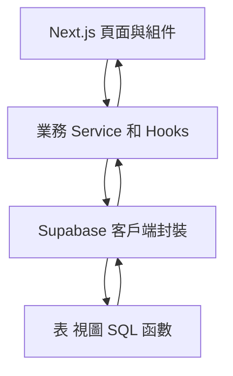
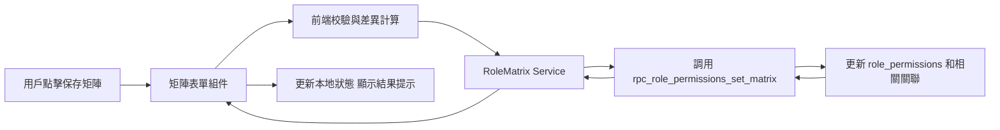

## Product Overview

在现有 v0 系统设置界面基礎上，完善「公海池」「业务规则」「组织架构 在职成员」「角色权限矩阵」四大模块，使其全部基於實際數據讀寫，而非本地 mock 或臨時 state，並在界面中提供清晰的表格、篩選、編輯抽屜與保存回饋狀態。

## Core Features

### 公海池模塊

- 公海線索列表視圖，支持按線索屬性、公海池、歸屬人、時間等條件篩選與排序。
- 公海線索與線索詳情面板聯動，展示關鍵字段與敏感字段讀取狀態。
- 支持將線索從個人池轉入公海池，從公海池領取或分配給指定成員，操作結果及錯誤在界面提示。
- 公海池配置區，展示各公海池名稱、適用範圍、策略標籤與啟用狀態，使用列表加側邊抽屜編輯。

### 業務規則模塊

- 業務規則列表頁，以表格展示規則名稱、類型 生效場景、優先級、狀態和最近更新人。
- 新建與編輯規則表單以抽屜或彈窗呈現，支持條件配置、觸發動作配置和啟停開關。
- 規則啟停、排序調整等操作後，界面自動刷新當前列表並顯示成功或失敗提示。
- 當無規則時顯示空狀態插畫與引導按鈕。

### 組織架構 在職成員 模塊

- 左側樹形組織結構，右側在職成員列表，支持按部門節點聯動刷新成員。
- 成員列表展示姓名、職位、角色、在職狀態、上級等字段，支持搜尋與篩選。
- 支持在職成員的添加、更換部門、調整上級等操作，通過編輯抽屜完成。
- 明確展示當前登錄用戶可見的部門和成員，對無權訪問的內容提供灰置或提示。

### 角色權限矩陣模塊

- 角色列表與權限矩陣聯動視圖，左側角色列表，右側按功能模塊分組的權限矩陣表格。
- 允許用戶在矩陣中勾選或取消具體權限點，支持按模塊折疊、全選和搜索權限鍵。
- 點擊保存後顯示提交中狀態、成功提示與錯誤提示，對保存失敗時給出具體錯誤信息展示區。
- 將最近修改時間與操作人展示在矩陣頁頭，便於辨識當前配置版本。

### 通用交互與視覺

- 列表頁與設置頁統一使用卡片加表格布局，保持與現有 v0 設計風格一致。
- 所有異步操作提供 Loading、成功、警告與錯誤狀態反饋；異常時保留用戶已編輯內容。
- 支持基本響應式布局，在常見桌面分辨率下保持內容區寬度與操作控件位置一致。

## 技術棧

- 前端框架：沿用現有 Next.js 應用，使用 React 和 TypeScript。
- 數據訪問：使用 Supabase JavaScript 客戶端調用視圖、表和 RPC 函數。
- 狀態管理與數據請求：React 狀態配合自定義 hooks 或數據請求庫統一封裝。
- 後端數據層：基於 Supabase 提供的表、視圖和 SQL 函數，包括 leads、leads\_secure\_view、公海池相關表、業務規則表、組織和成員表、角色與權限表等。

## 系統架構

採用前端單體應用 配合後端數據服務的分層架構：

- 表現層：Next.js 頁面與 UI 組件，負責展示列表、表單與權限矩陣。
- 應用層：按模塊拆分的 service 和 hook，封裝公海池、業務規則、組織架構與角色矩陣的業務操作。
- 數據訪問層：統一 Supabase 客戶端封裝，處理表查詢、視圖查詢和 RPC 調用。
- 數據存儲層：Supabase 內部表、視圖和 SQL 函數，承載實際業務數據和權限控制。



## 模塊劃分

1. **PublicPoolModule 公海池模塊**

- 職責：公海池列表、公海線索操作、公海策略配置。
- 依賴：Supabase leads、leads\_secure\_view、公海池相關 RPC，審計中心 RPC。
- 接口：`fetchPublicLeads`、`transferToPool`、`assignFromPool`、`fetchPoolConfigs` 等。

2. **BusinessRulesModule 業務規則模塊**

- 職責：業務規則列表、詳情、創建編輯和啟停。
- 依賴：業務規則表和配置 RPC。
- 接口：`listRules`、`getRuleDetail`、`upsertRule`、`toggleRuleStatus`。

3. **OrgStructureModule 組織架構模塊**

- 職責：部門樹、在職成員管理和成員調整。
- 依賴：部門表、成員表及相關 RPC。
- 接口：`fetchOrgTree`、`listActiveMembers`、`updateMemberOrg`。

4. **RolePermissionMatrixModule 角色權限矩陣模塊**

- 職責：角色列表、權限矩陣讀寫與保存流程。
- 依賴：角色表、permission\_keys、role\_permissions、`rpc_role_permissions_set_matrix` 函數。
- 接口：`fetchRoles`、`fetchRoleMatrix`、`saveRoleMatrix`。

5. **SharedAuditModule 審計統一封裝**

- 職責：對公海線索操作、規則變更、權限變更進行審計記錄調用。
- 依賴：審計中心 RPC。
- 接口：`recordAuditEvent`。

## 關鍵數據流

### 角色權限矩陣保存流程



流程描述：

- 表單組件收集矩陣勾選結果，計算與原始矩陣的差異，生成權限鍵列表。
- Service 層調用 RPC，傳入角色識別字段和權限鍵集合。
- RPC 在數據庫中寫入 role\_permissions，處理插入、刪除或更新。
- 根據 RPC 返回結果，前端更新矩陣狀態並展示成功或錯誤提示，錯誤時展示具體錯誤信息。

## 目錄結構示例

```text
e:/iwish-sell-crm/
├── src/
│   ├── app/
│   │   ├── settings/
│   │   │   ├── public-pool/
│   │   │   ├── business-rules/
│   │   │   ├── org-structure/
│   │   │   └── roles-permissions/
│   ├── modules/
│   │   ├── publicPool/
│   │   ├── businessRules/
│   │   ├── orgStructure/
│   │   └── roleMatrix/
│   ├── services/
│   │   ├── supabaseClient.ts
│   │   ├── publicPoolService.ts
│   │   ├── businessRulesService.ts
│   │   ├── orgStructureService.ts
│   │   └── roleMatrixService.ts
│   └── components/
└── ...
```

## 關鍵代碼結構示例

```typescript
// 公海池線索
interface PublicLead {
  id: string;
  poolId: string;
  ownerId: string | null;
  createdAt: string;
}

// 角色權限矩陣
interface RolePermissionMatrix {
  roleId: string;
  permissions: string[];
}

class RoleMatrixService {
  async fetchMatrix(roleId: string): Promise<RolePermissionMatrix> {}
  async saveMatrix(data: RolePermissionMatrix): Promise<void> {}
}
```

## 技術實施要點概述

1. 為四個模塊補全 service 層，將現有 mock 和本地 state 替換為真正數據調用。
2. 在 UI 層補充 Loading、空態和錯誤展示，並統一操作後刷新策略。
3. 針對 `rpc_role_permissions_set_matrix` 保存錯誤，逐步排查權限、函數部署和外鍵約束，修復後統一錯誤處理與提示。
4. 在關鍵操作點添加審計上報調用，保持與審計中心的數據一致性。

## Agent Extensions

### SubAgent

- **code-explorer**
- Purpose: 在整個倉庫中快速定位公海池、業務規則、組織架構和角色矩陣相關文件與現有實現。
- Expected outcome: 輸出清晰的文件分佈與現狀說明，支持後續精準修改和重構。

### MCP

- **chrome-devtools**
- Purpose: 在本地調試時抓取 Supabase RPC 請求與響應，特別是角色矩陣保存操作，觀察實際錯誤信息和狀態碼。
- Expected outcome: 明確定位 `rpc_role_permissions_set_matrix` 調用失敗的具體原因，為後續修復提供依據。

- **Figma**
- Purpose: 如果存在對應 PRD 或設計文件，在 Figma 中對照確認各設置頁的交互細節與字段呈現。
- Expected outcome: 保證實際落地的公海池、業務規則、組織架構與角色矩陣界面與設計稿保持一致。