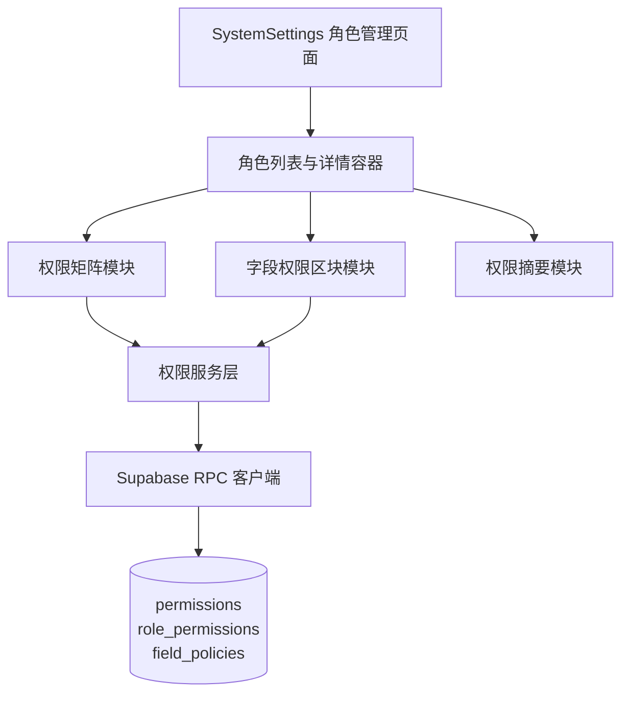

## Product Overview

在 SystemSettings 的角色管理中，将操作权限与字段级权限以统一的中文“权限节点”形式配置，通过后端 RPC 映射 Supabase 的 permissions/role_permissions/field_policies，实现单一入口的角色权限配置界面。

## Core Features

- 角色详情页增加「权限配置」区域，采用左右分栏布局：左侧为权限分类树，右侧为权限矩阵与字段权限区块。
- 权限节点全部使用中文名称和简短说明，按业务对象（客户、线索、订单等）与功能模块分组，支持展开折叠与关键字搜索。
- 字段权限区块聚焦敏感字段（如手机号、邮箱、内部备注等），以表格形式展示字段行和权限选项列。
- 单字段权限提供「可见性」与「可编辑性」等简单选项，如：明文可见/脱敏可见/不可见，和可编辑/只读。
- 角色加载时，通过 RPC 获取该角色的权限与字段策略汇总，自动勾选对应权限节点与字段选项，不暴露 field_policies 等底层概念。
- 保存时，点击固定在底部的「保存权限」按钮，将当前权限矩阵与字段权限选项组合为统一权限配置数据，调用 RPC 写入 Supabase。
- 右侧附带「权限摘要」区域，以自然中文句式概览当前角色在关键对象和字段上的查看与编辑能力，并提示未保存变更状态。

## 技术栈与架构

- 前端：基于现有项目扩展，采用 React 组件化实现 SystemSettings 角色管理界面与权限矩阵。
- 状态管理：利用 React 组合式状态和请求库（如 React Query）管理权限数据的加载、编辑和保存状态。
- 数据交互：通过 Supabase 提供的 RPC 接口（如 get_role_permissions、set_role_permissions），以 JSON 结构传递统一的权限节点配置。
- 数据模型：前端维护 Role、PermissionNode、FieldPermissionConfig 等模型，分别对应角色、操作权限节点与字段级权限配置。

### 系统架构



### 模块划分

- 角色管理页面模块：承载角色列表、角色详情抽屉或页面切换，并注入当前选中角色信息。
- 权限矩阵模块：按业务对象与操作维度渲染权限节点，支持批量勾选、全选、搜索过滤。
- 字段权限区块模块：按对象分组展示敏感字段行，为每个字段渲染可见性和可编辑性控件。
- 权限服务层模块：负责将后端权限数据解析为前端 PermissionNode 与 FieldPermissionConfig 结构，以及将前端勾选状态反向映射为 RPC 所需的 payload。
- RPC 客户端模块：封装 get_role_permissions 与 set_role_permissions 调用，统一处理错误提示与加载状态。

### 数据流


### 目录与关键代码结构

```text
src/
├── pages/SystemSettings/RoleManagement/
│   ├── RoleListPage.tsx
│   ├── RoleDetailDrawer.tsx
│   └── PermissionConfigPanel.tsx
├── components/permissions/
│   ├── PermissionMatrix.tsx
│   ├── FieldPermissionBlock.tsx
│   └── PermissionSummary.tsx
├── services/permissions/
│   ├── rpcClient.ts
│   ├── mapping.ts
│   └── types.ts
```

- API 约定：
- GET RPC get_role_permissions(role_id): 返回权限节点列表与字段权限配置。
- POST RPC set_role_permissions({ role_id, permissionNodes, fieldPolicies }): 写入 permissions/role_permissions/field_policies。
- 状态管理：PermissionConfigPanel 作为容器，集中维护权限树与字段权限的状态，子组件通过 props 或上下文同步。
- 数据模型示例：

```typescript
interface PermissionNode {
  key: string;
  label: string;
  group: string;
  checked: boolean;
}

interface FieldPermissionConfig {
  object: string;
  field: string;
  visibility: 'plain' | 'masked' | 'hidden';
  editable: boolean;
}
```

## 设计方案

- 整体采用企业级设置后台风格，布局为左侧导航、中间角色详情、右侧权限摘要，界面简洁但信息密度高。
- 角色详情顶部为角色名称与基础信息卡片，下方分为「基础信息」「权限配置」页签，当前需求集中在「权限配置」。
- 权限配置区域上方为权限分类标签（操作权限、字段权限），用户在标签间切换时，下方展示对应矩阵或字段表格。
- 操作权限矩阵采用栅格表格样式，行展示业务对象，列展示权限类型，勾选采用清晰的复选框与悬浮说明。
- 字段权限区块为分组卡片，每个业务对象一张卡片，内含敏感字段表格，行展示字段名称，列为可见性单选组与可编辑开关。
- 右侧权限摘要区块以卡片形式展示重点权限描述，支持随勾选动态更新，未保存变更时顶部展示醒目提示条。
- 表单控件采用圆角、轻阴影与细分割线，保证在高信息量下仍易读；交互变化配合微动画（如勾选、展开折叠）。
- 支持响应式布局，在宽屏下显示三栏，在较窄屏幕下自动折叠为上下布局，保证可用性。

## Agent Extensions

### SubAgent

- **code-explorer**
- Purpose: 全局检索并理解现有角色管理和权限相关代码结构。
- Expected outcome: 找到当前角色管理 UI、权限模型和与 Supabase 交互的实现位置，为新特性落地提供依据。

### MCP

- **Figma**
- Purpose: 辅助绘制角色权限配置页面的线框图与高保真原型。
- Expected outcome: 形成可视化的权限矩阵与字段权限区块设计稿，用于前端实现对照。