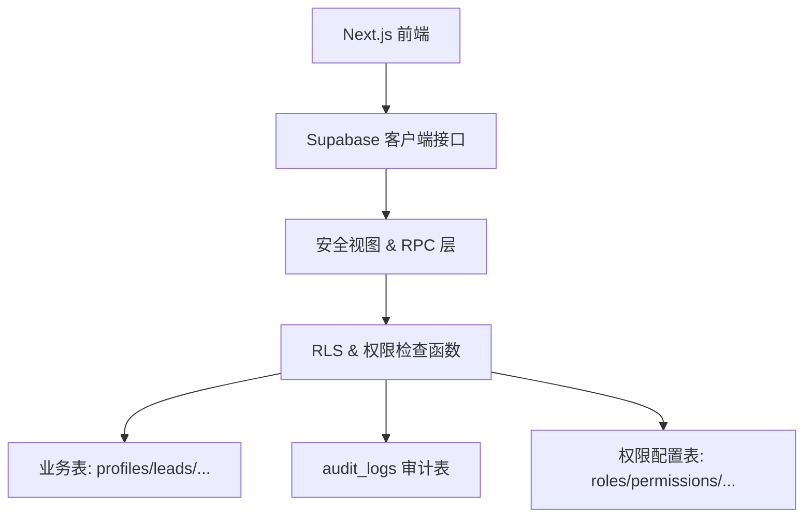
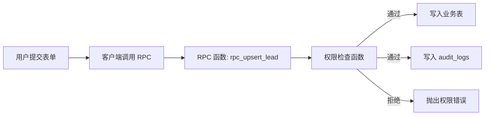

## Product Overview

首阶段为 Iwish CRM 搭建一套完整的一致的数据与权限后端：覆盖用户档案、业务实体、状态机、访问控制与审计日志，在现有界面不变的前提下，使所有数据访问与写入行为具备可控性与可追踪性。

## Core Features

- 建立用户与员工档案及状态机，用于区分内部成员、外部访客与停用账户  
- 建立潜在客户等核心业务实体的数据结构，支撑线索归属、协作与转化流程  
- 定义角色、权限、字段级策略与自定义作用域集合，实现细粒度访问控制  
- 通过安全视图统一暴露线索等敏感数据的读取入口，屏蔽底层实现细节  
- 通过统一动作接口完成关键写操作，并记录到审计日志，支持责任追踪  
- 初始化系统所需角色、权限、字段策略与作用域种子数据，环境创建后可直接使用  
- 本阶段不改动任何界面与交互，所有变化体现为数据安全性与行为一致性的提升

## 技术栈与架构模式

- 数据层：Supabase 托管的 PostgreSQL 数据库  
- 安全层：行级安全策略（RLS）、安全视图、最小权限角色  
- 逻辑层：数据库内函数与 RPC，统一权限检查与审计  
- 迁移与种子：SQL 迁移脚本 + 初始化种子脚本，纳入现有仓库版本管理  

采用分层单体架构：以数据库为唯一后端，前端仅通过安全视图与 RPC 访问。



## 模块划分

### 1. 身份与档案模块

- 职责：维护用户档案、员工信息与 profiles.status 状态机（如 active/inactive/invited 等）  
- 依赖：认证标识（auth 用户）、审计模块  
- 暴露对象：profiles 表、安全视图 profiles_secure_v、状态变更 RPC（如 rpc_change_profile_status）

### 2. 权限与角色模块

- 职责：建模角色、权限点、角色-权限关联、字段级策略、自定义作用域集合  
- 核心表：roles、permissions、role_permissions、field_policies、custom_scope_sets  
- 依赖：profiles、审计模块  
- 暴露对象：权限检查函数（check_permission、resolve_scope 等）

### 3. CRM 业务实体模块

- 职责：按照 prd.md 定义 leads 等核心实体，含归属关系、阶段、标签、来源等字段  
- 依赖：profiles（归属人与跟进人）、权限模块  
- 暴露对象：业务表（leads 等）与只读安全视图（如 leads_secure_v）

### 4. 安全视图与 RLS 模块

- 职责：在业务表之上提供 secure view，集中承载字段打码、过滤逻辑  
- 内容：为 profiles、leads 等关键表创建 *_secure_v 视图，并为底表开启 RLS  
- 依赖：权限模块提供的作用域解析函数  

### 5. 函数 / RPC 与审计模块

- 职责：封装所有关键写操作，统一做权限检查与审计入库  
- 内容：业务 RPC（如 rpc_upsert_lead、rpc_assign_lead）、审计写入函数 log_audit_event  
- 依赖：业务实体表、权限模块、audit_logs 表  

### 6. 种子与配置模块

- 职责：初始化系统默认权限模型与基础配置  
- 内容：插入默认 roles、permissions、role_permissions、field_policies、custom_scope_sets 等  
- 依赖：相关表全部创建完成  

## 数据流设计

### 线索读取数据流

```mermaid
flowchart LR
  U[用户(前端)] --> C[客户端 SDK 查询]
  C --> V[secure view: leads_secure_v]
  V --> R[RLS 策略]
  R --> T[底层 leads 表]
```

- 前端仅查询 leads_secure_v  
- RLS 根据当前用户身份、角色与作用域限制可见行  
- 视图负责字段脱敏（如隐藏他人线索手机号）

### 关键写操作数据流



- RPC 首先调用权限函数检查操作是否允许  
- 成功则在事务内写业务表并追加审计记录  
- 审计记录包含操作者、时间、对象、旧值/新值等要素  

## 目录与文件组织

```text
e:/iwish-sell-crm/
├── supabase/
│   ├── schema/
│   │   ├── 01_core_profiles.sql
│   │   ├── 02_permissions_rbac.sql
│   │   ├── 03_crm_entities.sql
│   │   ├── 04_secure_views_rls.sql
│   │   └── 05_functions_rpc_audit.sql
│   ├── seeds/
│   │   ├── 01_roles_permissions_seed.sql
│   │   ├── 02_field_policies_seed.sql
│   │   └── 03_custom_scope_sets_seed.sql
│   └── README.md
└── prd.md
```

## 核心代码结构示例

```sql
-- 权限检查函数示例
create function app.check_permission(
  p_user_id uuid,
  p_action text,
  p_resource text
) returns boolean as $$
begin
  -- 结合 roles/permissions/field_policies/custom_scope_sets 进行判定
  return exists (
    select 1
    from app.effective_permissions ep
    where ep.user_id = p_user_id
      and ep.action = p_action
      and ep.resource = p_resource
  );
end;
$$ language plpgsql security definer;

-- 带审计的 RPC 示例
create or replace function app.rpc_upsert_lead(
  p_payload jsonb
) returns uuid as $$
declare
  v_user_id uuid := auth.uid();
  v_lead_id uuid;
begin
  if not app.check_permission(v_user_id, 'upsert', 'lead') then
    raise exception 'permission denied' using errcode = '42501';
  end if;

  -- 业务写入略
  -- insert/update leads returning id into v_lead_id;

  insert into app.audit_logs(actor_id, action, resource, payload)
  values (v_user_id, 'upsert', 'lead', p_payload);

  return v_lead_id;
end;
$$ language plpgsql security definer;
```

## 实施要点与技术考量

- RLS 一律默认拒绝，逐表按最小权限白名单开放  
- 权限检查函数坚持“单一入口”，避免前端绕过  
- 为高频查询字段建立索引（如 owner_id、status、pipeline_stage 等）  
- 审计写入放在与业务写入同一事务中，保证一致性  
- 通过种子脚本保证新环境一键初始化默认角色与权限配置  

## Agent Extensions

### SubAgent

- **code-explorer**  
- Purpose: 遍历并阅读 e:/iwish-sell-crm 仓库中的 prd.md 与相关 SQL/文档，提取精确业务与字段定义  
- Expected outcome: 形成与 PRD 完全一致的表结构、字段、状态机与权限规则清单，为后续 schema 与策略实现提供依据